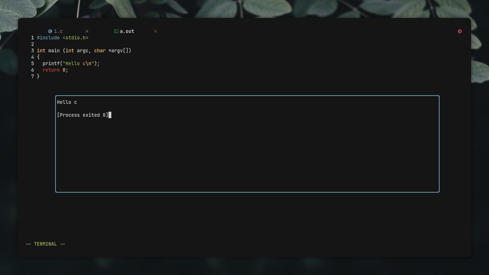

<h1 align="center">Run.nvim</h1>
<h4 align="center">snazzy floating window for file/script execution</h4>

<p align="center">
    <a href="https://github.com/Manas140/run.nvim/stargazers"></a>
    <a href="https://github.com/Manas140/run.nvim/issues"></a>
    <a href="https://github.com/Manas140/run.nvim/network/members"></a>
</p>

<p>
  
</p>


## Installation

### Packer
```lua
use 'Manas140/run.nvim'
```

### Manual Installation
```sh
  git clone https://github.com/Manas140/run.nvim && cd run.nvim
  nvim --cmd "set rtp+=."
```

## Execute The Plugin
```
  Keybind - Control + E
  Command - :Run
```

## Supports
```
 - c       - cpp      - dart
 - go      - html     - java
 - js      - lua      - perl
 - php     - python   - r
 - rust    - sh       - swift
```
