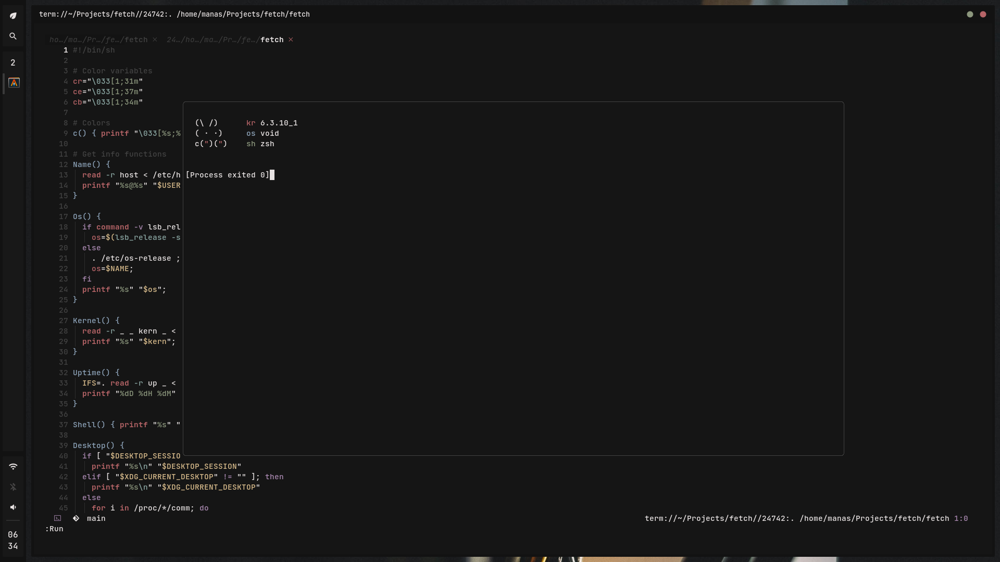

<h1 align="center">Run.nvim</h1>
<h4 align="center">snazzy floating window for file/script execution</h4>

<p align="center">
  <a href="https://github.com/Manas140/run.nvim/stargazers"></a>
  <a href="https://github.com/Manas140/run.nvim/issues"></a>
  <a href="https://github.com/Manas140/run.nvim/network/members"></a>
</p>

<p>
  
</p>

## Installation

- Packer

```lua
use 'Manas140/run.nvim'
```

- Lazy 

```lua
  {
    dir='~/Projects/run.nvim',
    config = function ()
      require('run').setup()
    end
  }
```

- Vim Plug 

```lua 
Plug 'Manas140/run.nvim'
```

## Configuration 

- Use Default 

```lua 
require('run').setup()
```

- Configure 

```lua 
require("run").setup {
  ui = {
    gap = [0.1-0.9],
    border = "[none|single|double|rounded|solid|shadow]",
    border_cl = "Comment", -- provide a highlight 
    bg = "Normal", -- provide a highlight
  },
  cmd = {
    -- variables, $path for entire path, $dir for current dir, $name for name without extention
    filetype = "command $path $dir $name",
  },
}
```

## Usage 

```
:Run
```

## References

- [vscode-code-runner](https://github.com/formulahendry/vscode-code-runner)
